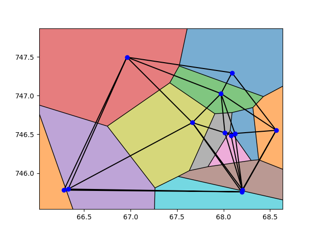

# Diagrama de Voronoi


Este projeto faz uso do Diagrama de Voronoi é a triangulação de Delaunay para mostrar como está distribuído um conjuntos de pontos no plano, o caso de uso abordado para esse projeto é exibir como estava distribuído os Hospitais Municipais, Estaduais ou Federais no Município do Rio de janeiro em um dos momentos mais críticos da covid-19 em 05/20 - 09/20.

Para isso foi feito uma busca pelos Hospitais que estavam atendendo o público nesse período, com essa listagem foi pego cada ponto de latitude e longitude para ser convertido em coordenadas métricas para um plano cartesiano, depois desse tratamento manual, com essas coordenadas é possível passar essa lista de pontos para o script que ao final gera uma imagem do Diagrama de Voronoi com a Triangulação de Delaunay dos pontos que foi definido.

Este projeto é aberto para contribuição e tem muita margem para evoluções futuras.
 
## Dependencies

- Python >=3.9


## Desenvolvimento

### Pre Configurações
* Instale o Python em sua maquina, senão tiver o Python pode ver esse [link](https://www.python.org/downloads/) 
* Crie uma virtualenv, senão souber criar pode ver esse [link](https://www.treinaweb.com.br/blog/criando-ambientes-virtuais-para-projetos-python-com-o-virtualenv/)


### Rodar Projeto

* Faça o setup do projeto
```sh
make setup
```

* Se quiser rodar o projeto com todos os Hospitais(Municipal, Estadual, Federal, Hospital de Campanha)  
```sh
make run
```

* Se quiser rodar o projeto so com os Hospitais de atendimento ao público(Municipal, Estadual, Federal)  
```sh
make run hosp=hospital
```

* Se quiser rodar o projeto com valores aleatorios
```sh
make run randon=True
```

* Se quiser rodar o projeto com valores aleatorios e definir quantidade de pontos
```sh
make run randon=True qntd=20
```


Quando você usar por exemplo make run no seu terminal, irá gerar uma imagem como essa aqui em baixo na sua tela, você poderá salva-lá também.  

